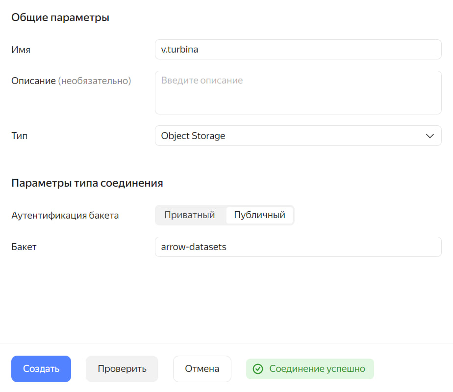
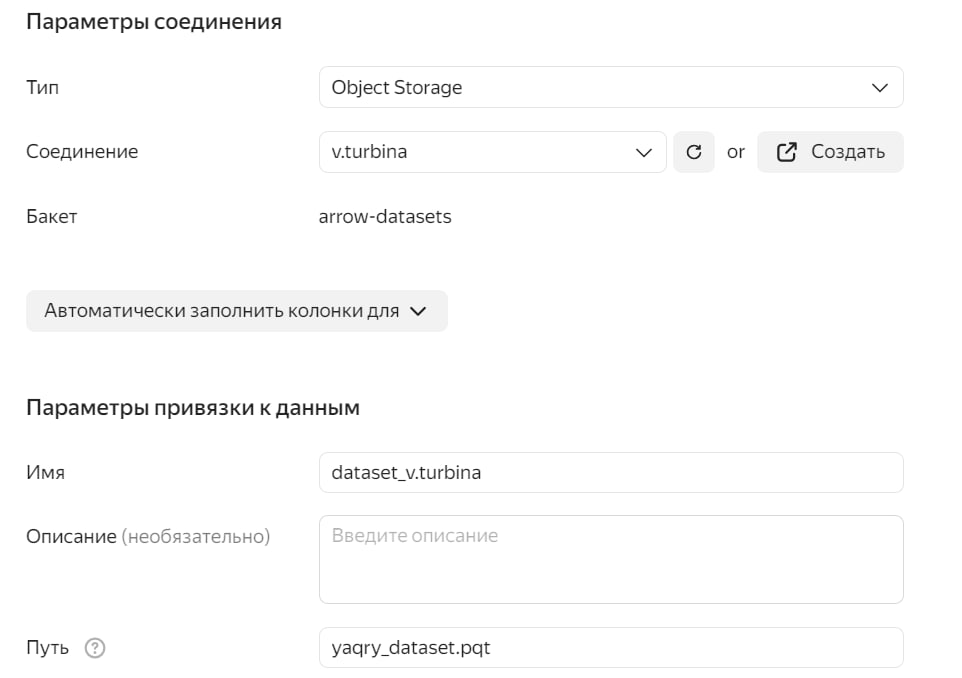
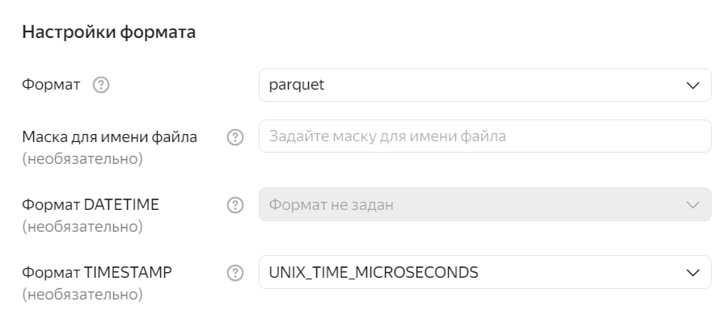
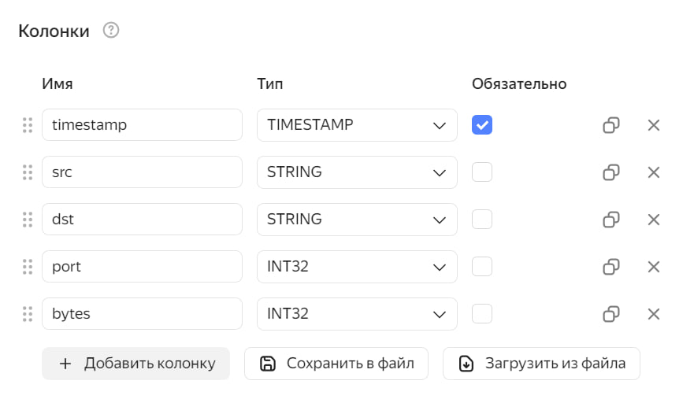
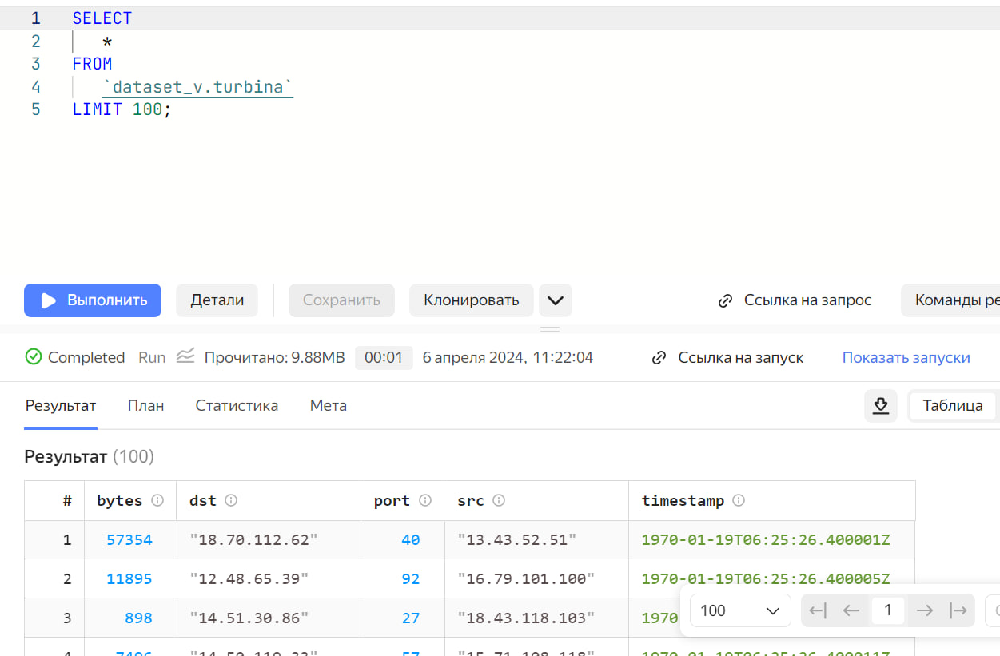
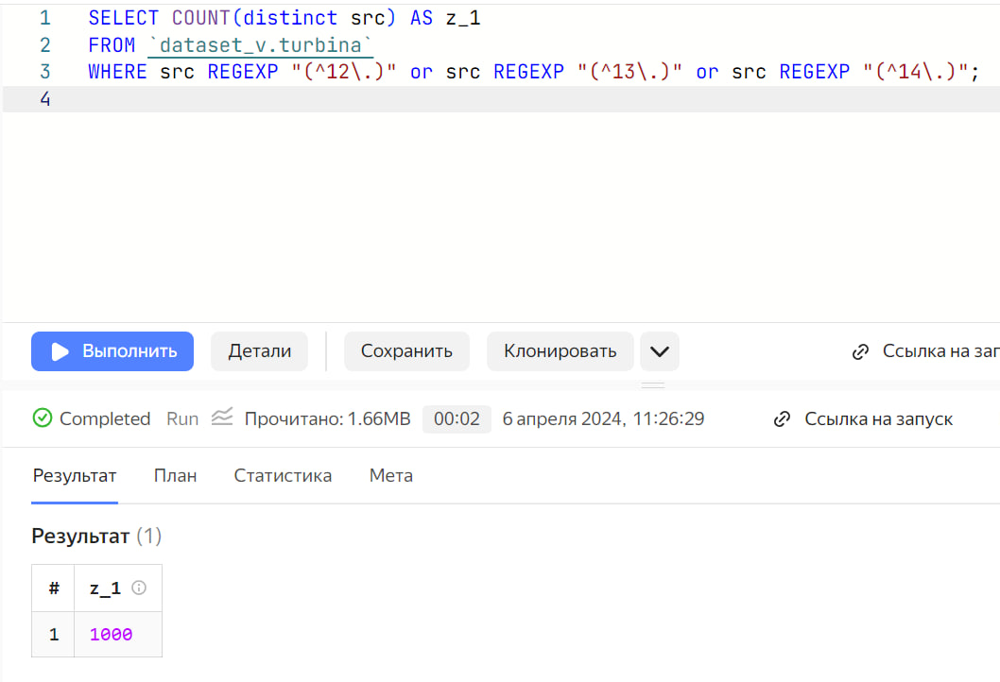
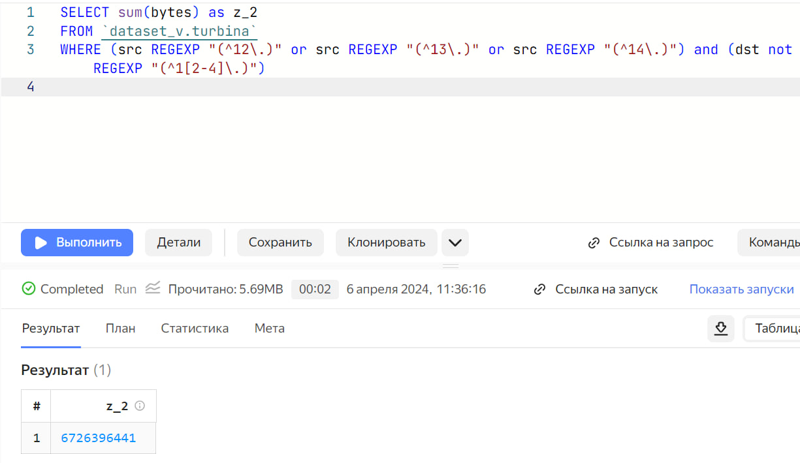
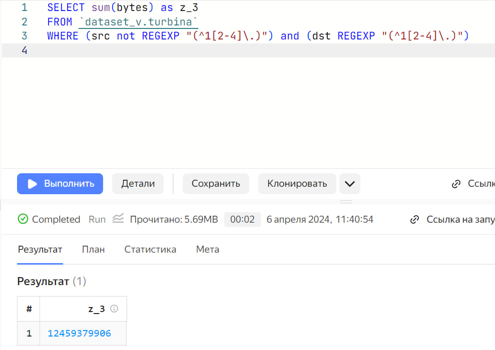

# lab_1
vi.lochka@yandex.ru

## Цель работы

1.  Изучить возможности технологии Yandex Query для анализа
    структурированных наборов данных

2.  Получить навыки построения аналитического пайплайна для анализа
    данных с помощью сервисов Yandex Cloud

3.  Закрепить практические навыки использования SQL для анализа данных
    сетевой активности в сегментированной корпоративной сети

## Ход работы

### Проверить доступность данных в Yandex Object Storage

Проверьте доступность данных (файл yaqry_dataset.pqt) в бакете
arrow-datasets S3 хранилища Yandex Object Storage. Проверить можно
просто перейдя по правильно сконструированному URL в браузере.

    <https://storage.yandexcloud.net/arrow-datasets/yaqry_dataset.pqt>

### Подключить бакет как источник данных для Yandex Query

Yandex Query – это облачное решение для анализа данных, в котором задачи
организации хранения, обеспечения доступа и выполнения первичного
анализа данных полностью берет на себя сервис-провайдер, то есть Yandex
Cloud.

1.  Войдем в свой аккаунт и подключимся к Yandex Cloud

2.  Создадим соединение для бакета в S3 хранилище.

3.  Заполняем поля с учетом допустимых символов, выбираем тип
    аутентификации. Вводим имя бакета в соответствующее поле и
    сохраняем.

    

4.  Настроем привязку данных

    

5.  Опишем состав и формат входных данных

    

    

6.  Если настройки сделаны правильно, то можно попробовать сделать
    аналитический запрос и посмотреть результат

    

### Провести анализ данных

1.  Известно, что IP адреса внутренней сети начинаются с октетов,
    принадлежащих интервалу \[12-14\]. Определите количество хостов
    внутренней сети, представленных в датасете.

    

``` r
sprintf("Задание выполнено!")
```

    [1] "Задание выполнено!"

1.  Определите суммарный объем исходящего трафика



``` r
sprintf("Задание выполнено!")
```

    [1] "Задание выполнено!"

1.  пределите суммарный объем входящего трафика



``` r
sprintf("Задание выполнено!")
```

    [1] "Задание выполнено!"

## Оценка результатов

Задача выполнена при помощи облачных сервисов Yandex Cloud и технологии
Yandex Query, удалось познакомится с их функционалом и особенностями.

## Вывод

В данной работе я смогла закрепить практические навыки использования SQL
для анализа данных сетевой активности в сегментированной корпоративной
сети и получить навыки построения аналитического пайплайна для анализа
данных
